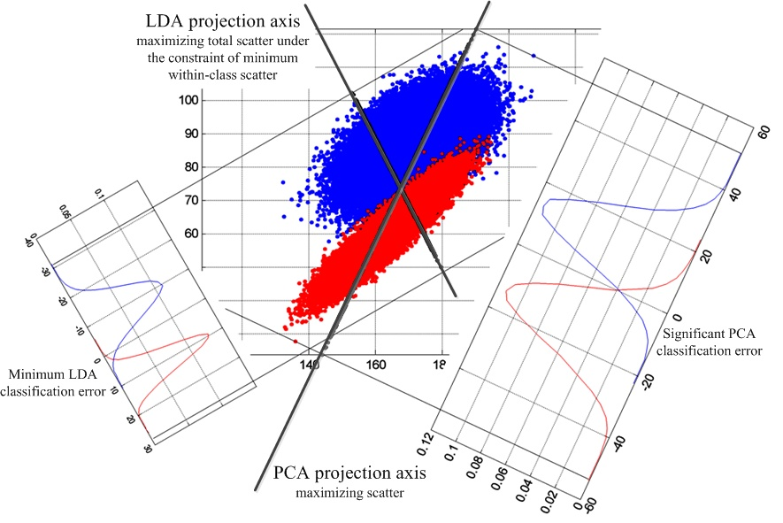

## Agenda

1. Why to reduce features?
2. Classical Techniques of feature reduction:
  * Techniques Based on Information theory/Entropy: WOE, Mutual Information
  * Classical Statistical Ideas: Chi Square, F test, Zero Variance
3. Techniques from ML school:
  * Regularization: L1 and L2 norm
4. Techniques based on Reduced Feature space:
  * PCA, LDA
  

--- .class #id 

## Why to reduce features?

* Multi fold issue:
  * Modelling very high dimension data sets can be computationally very expensive
  * Variables might be highly correlated: Linear Models assume there is no multidisciplinary
  * There might be some latent relationships that can be unearthed by reducing the dimensions

* From a modelling perspective, dimensional reduction/feature selection are synonymous

* From a data exploration/visualization perspective, dimensionality reduction has a slightly different meaning, will see with an example

--- .class #id

## The DRT Zoo

<iframe src='DRT_ZOO.html'></iframe>
  

--- .class #id

## Classical Techniques

* One of the most common task while modelling is to select variables before modelling process begins.

* In Finance, Telecom and Retail industry, where propensity models are built, sifting through relevant variables can be quiet a daunting task.

* In most binary classification problems, Information Value or IV is most commonly used metric

* IV has been inspired from entropy/Mutual Information

* There are packages in R which can compute IV, while in Python, Mutual Information is computed


--- .class #id

## Classical Techniques

* Mutual Information for two Random Variables X and Y is defined as:

$$\sum_{x \in X}\sum_{y \in Y} p(x,y) log\frac{p(x,y)}{p(x)p(y)};x,y \in R$$ 

* Why do you think this equation makes sense? (Hint: While doing variable selection we are looking at the correlation between dv and idv)

* Can you think of bounds to this identity? When there is no relationship between two variables what will be the value of MI?

* If you think about it, this expression is not greatly different from the idea of correlation, may be more general.

* Both R and Python have inbuilt routines to compute mutual information.


--- .class #id

## Classical Techniques

* Lets look at some code that can help us in doing feature selection based on mutual information


```r
setwd('/media/ramius/New Volume/Work/Jigsaw Academy/CasesFinancial/Data')
data=read.csv('Aquisition_Risk.csv')
data=data[,-c(14,15)]
data=na.omit(data)
library(entropy)
print(mi.plugin(table(data$Good_Bad,data$grade)))
```

```
## [1] 0.005513751
```


--- .class #id

## Classical Techniques


```r
y=data$Good_Bad
x=data[-24]
MI<-function(x,y){
  MI_Store<-1:length(x)
  names(MI_Store)<-names(x)
  for(i in 1:length(x)){
   MI_Store[i]<- mi.plugin(table(y,x[[i]]))
  }
  MI_Store=data.frame(MutualInfo=sort(MI_Store,decreasing = T))
  
return(MI_Store)  
}
mutual_information<-MI(x=x,y=y)
```


--- .class #id

## Classical Techniques 


```
##                   MutualInfo
## loan_status      0.193767717
## earliest_cr_line 0.192324258
## GreaterThan120   0.129159550
## revol_bal        0.092883848
## Between31_120    0.037936762
## annual_inc       0.027099639
## dti              0.015783384
## loan_amnt        0.006464012
```


--- .class #id

## Classical Techniques

* Here is a python routine, this feature is available in sklearn version 18
(The detailed script is available separately)


```python
import sklearn.feature_selection as feature_selection
MI=feature_selection.mutual_info_classif(X,y)
print MI.sort_values()
#X,y are predictor matrix and target vector

```


--- .class #id

## Classical Techniques


```
## delinq_2yrs        0.000000
## total_acc          0.001419
## dti                0.001694
## fico_range_low     0.001906
## revol_bal          0.002134
## loan_amnt          0.002955
## annual_inc         0.003029
## open_acc           0.003479
## fico_range_high    0.003740
## inq_last_6mths     0.008058
## dtype: float64
```


--- .class #id

## Classical Techniques

* Based on the idea of mutual information, there is a metric which is widely used in industry, called Information Value or IV

* IV is used to screen variables for a binary classification problem

* The way IV is defined is 

$$IV_{x}=\sum_{i=1}^{10}(bad_i-good_i)ln(\frac{bad_i}{good_i}) $$


--- .class #id

## Classical Techniques

* In industry people write custom macros to compute IV. Though there are some R packages that help in computing IV out of the box. I couldn't locate any python implementation save for an obscure code on some github repository.

* Traditionally people used to work with VBA macros or SQL codes to compute IVs


```r
library(smbinning)
data$Target<-ifelse(data$Good_Bad=='Good',1,0)
head(smbinning(data,y="Target",x="loan_amnt",p=0.05)$ivtable,2)
```

```
##   Cutpoint CntRec CntGood CntBad CntCumRec CntCumGood CntCumBad PctRec
## 1  <= 5225  20651   19213   1438     20651      19213      1438 0.1632
## 2  <= 9725  28073   26681   1392     48724      45894      2830 0.2219
##   GoodRate BadRate    Odds LnOdds     WoE     IV
## 1   0.9304  0.0696 13.3609 2.5923 -0.3864 0.0291
## 2   0.9504  0.0496 19.1674 2.9532 -0.0255 0.0001
```


--- .class # id

## Classical Techniques

Here is a python code snippet


```python
import information_value as information_value
import numpy as np
x=np.array(X['loan_amnt'])
y=np.array(y)
woe=information_value.WOE()
print woe.woe_single_x(x=woe.discrete(x),y=y)
```


--- .class #id

## Classical Techniques

* There are still some metrics that are can be used to do feature selection, eg doing a chi square test of factor independence to see if two categorical variables are related.

* If there is very little variance in a feature then it is indicative of non dependence of that feature.

* Its easy to find routines that can implement chi square test and compute variance

* Implementation is left as an exercise


--- .class #id

## Techniques from ML school: L1 and L2 norms

* These techniques have been inspired from ML school, the idea is to do feature selection as well as model building simultaneously

* Originally developed to handle over fitting in linear models, these can still be used as an aid to feature selection

* Mostly used to reduce dimensionless when data will naturally tend to have very large number of dimensions eg. Image data

* The idea is to add a  penalty term in the original cost function, the penalty can be an L1 (Lasso) penalty or L2 (Ridge) penalty

* L1 (Lasso), penalty can make some to the coefficients exactly zero and hence can aid in feature selection


--- .class #id

## Techniques from ML school: L1 and L2 norms

* This is how the cost functions are modified:

$$C(\beta)+\lambda\sum_{i}|\beta_i|$$

* Here $C(\beta)$ can be either RSS or Logistic cost function and $\lambda\sum_{i}|\beta_i|$ is the L1 penalty or L1 norm.

* To see the intuition behind why this cost function works, let's look at a modified linear regression cost function.

$$\sum_{i}(y_i-(\beta_0+x_1\beta_1+..+x_n\beta_n))^2+\lambda\sum_{i}|\beta_1+\beta_2+..+\beta_n|$$

* L2 penalty is different in the sense that instead of summing up absolute values of betas, we sum up their squares:

$$C(\beta)+\lambda\sum_{i}\beta^2_{i}$$

--- .class #id

## Techniques from ML school: L1 and L2 norms

* Let's look at some R and Python code implementing L1 penalty. The R code will be demoed with MNIST data set, we will use 8 by 8 pixel grey scale images.


```r
library(glmnet)
X=read.csv('mnist_x.csv',header=T)
Y=read.csv('mnist_y.csv',header=F,col.names = 'Target')
y=ifelse(Y$Target>7,1,0)
x=as.matrix(X)
mod<-cv.glmnet(x,y,family='binomial',alpha=1)## Does a cv search over a grid of lambdas
head(coef(mod,s=mod$lambda.min),3)
```

```
## 3 x 1 sparse Matrix of class "dgCMatrix"
##                      1
## (Intercept) -6.5052806
## X0           .        
## X1          -0.1342458
```


--- .class #id

## Techniques from ML school: L1 and L2 norms

* Let's look at a python code snippet, I am using a standard sklearn implementation

```python
import sklearn.linear_model as linear_model

clf=linear_model.LogisticRegressionCV(fit_intercept=True,cv=10,penalty='l1',n_jobs=-1,
solver='liblinear')

def get_target(x):
    if x>7:
        return 1
    else:
        return 0

y=mnist_y.map(get_target)

mod=clf.fit(mnist_x,y)

```


--- .class #id

## PCA and cousins

* Another set of techniques that are used, rely on changing the original feature space and projecting the features in new space, this new space has less dimensions compared to the original space

* Lets try to understand the intuition behind what it means to reduce the dimensions


--- .class #id

## PCA and cousins

* Let's look at another scenario: (Which "component" will you choose?, Guiding principle is?)


--- .class #id

## PCA and cousins

1. Here are a few facts that are worth mentioning:
  * Mathematically, choosing new "components" which captures maximum variance is akin to finding the Eigen Vectors of variance-covariance matrix of the data
  * Eigen value of each of these Eigen Vectors measures the variance captured by each eigen vector/principal component
  * Eigen values ($\lambda$) and Eigen vectors ($e_i$) can be computed if Variance-Covariance matrix ($\Sigma$) is known by making use of following equations:
  
  $$det(\Sigma-\lambda I)=0$$
 

$$\Sigma e_i=\lambda_ie_i$$
 * The computed eigen vector $e_i$, will look something like this
 
 $$e_i=(\beta_{i1},\beta_{i2},...,\beta_{in})$$


--- .class #id

## PCA and cousins

* The principal components are nothing but linear combination of original features. 
$$PC_1=\beta_{11}var_1+\beta_{12}var_2+...+\beta_{1n}var_n$$
$$PC_2=\beta_{21}var_1+\beta_{22}var_2+...+\beta_{2n}var_n$$
* The $\beta_{11}, \beta_{12}$ etc are loadings and can be used to figure out which original variables characterize the principal component

* One can project the points in a particular dimension by scoring that point on the respective principal component.


--- .class #id


## PCA and cousins

* How many components will you choose?


* How did you choose?


--- .class #id

## PCA and cousins

* Can we formalize the process of how many Principal Components to choose?
* What was the guiding principal to choose?
* Can we compute any measure to guide us in our endeavor? (Go back a few slides, you will find the answer)


--- .class #id

* Eigen value will measure the variance explained by an eigen vector (principal components)


--- .class #id

## PCA and cousins

* There are some data prep issues that have to be kept in mind

  * Features should be numeric only.

  * Features should be scaled before being fed into PCA method.

* There are some limitations as well to the use of PCA:
  
  * There is no guarantee that a supervised learning algorithm will do a good job if only principal components are used as predictors. 
  * There are methods like LDA (for linear classifiers) and PLS (for linear regressors) that create low dimensional features by keeping into account the target variable as well.

--- .class #id

## PCA and cousins: LDA

* PCA vs LDA


